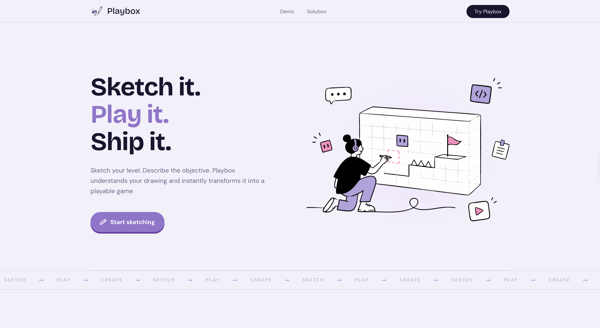

# PlayBox

**Sketch a game. Generate it. Play it. Tweak it with AI.**



PlayBox turns a drawing (or an uploaded image) into a playable browser game.
You draw on the canvas, say what should happen, hit Generate, then keep
improving it with chat — or by editing the sketch and regenerating.

---

## How it works

1. **Draw or upload** on the canvas (tldraw). Add labels if you want (Player, Enemy, Coin, Goal, etc.).
2. **Pick a mode** — Auto (AI chooses), an arcade template, Tic-tac-toe, or Flappy Bird.
3. **Describe the game** in a short sentence.
4. **Generate** — the app calls OpenAI and builds a game config.
5. **Play** on the right side of the editor.
6. **Tweak** with AI chat (“make it harder”, “yellow bird”, “night sky”), or edit the sketch and hit **Regenerate from sketch**.

```
Sketch / upload
  + labels + description + mode
        ↓
POST /api/generate-game  (Next.js → OpenAI)
        ↓
Game config (arcade / tic-tac-toe / flappy)
        ↓
Play in the browser
        ↓
Chat to tweak rules   or   edit sketch → Regenerate
```

You only need the **frontend** for the full sketch → generate → play → chat loop.
The backend folder is optional and not used by the editor today.

---

## Game modes

**Arcade templates** (one shared canvas renderer):

| Mode | Idea |
| ---- | ---- |
| `dodge` | Avoid hazards |
| `collect` | Pick up items |
| `pong` | Paddle vs ball |
| `snake` | Grow and don’t crash |
| `maze` | Find the way out |
| `clicker` | Click to score |
| `simple-shooter` | Shoot targets |
| `platform-jumper` | Jump on platforms |

**Dedicated modes** (their own engines):

| Mode | Idea |
| ---- | ---- |
| `tic-tac-toe` | Classic 3×3 board vs AI |
| `flappy-bird` | Tap / space to flap through pipes |
| `platformer` | Your sketch becomes the level — collect every coin, then reach the flag |

Choose **Auto** and the AI picks a mode from your sketch. If you pick Tic-tac-toe, Flappy Bird, or Platformer yourself, that mode always wins — the app will not turn them into a generic arcade game.

---

## Project layout

| Folder | What it is |
| ------ | ---------- |
| `frontend/` | The main app — landing page, dashboard, editor, and OpenAI API routes |
| `backend/` | Optional Fastify + Gemini service (not wired into the editor UI yet) |

More detail lives in `frontend/README.md` and `backend/README.md`.

---

## Quick start

### One command (frontend + backend)

```bash
./dev.sh
```

- App: [http://localhost:3000](http://localhost:3000)
- Backend health: [http://localhost:8080/health](http://localhost:8080/health)

`./dev.sh` installs deps on first run and can create `backend/.env`.
It does **not** create `frontend/.env.local` — add your OpenAI key there yourself (see below).

### Frontend only (enough to generate, play, and chat)

```bash
cd frontend
npm install
cp .env.example .env.local   # then add OPENAI_API_KEY
npm run dev
```

Open [http://localhost:3000](http://localhost:3000).

---

## Environment

Generation runs on the **frontend** Next.js server. Put secrets in
`frontend/.env.local` (gitignored). Never use a `NEXT_PUBLIC_` prefix for OpenAI keys.

```bash
# frontend/.env.local
OPENAI_API_KEY=sk-...
USE_MOCK_OPENAI=false
# OPENAI_MODEL=gpt-4.1-mini   # optional; this is the default (fast)
#                             # try gpt-5-mini for higher quality / slower runs
```

`OPEN_API_KEY` is also accepted as an alias for `OPENAI_API_KEY`.

Set `USE_MOCK_OPENAI=true` to try the UI without calling OpenAI
(example games + simple local chat tweaks).

Optional Supabase keys are listed in `frontend/.env.example`.
Projects are saved in the browser with **localStorage** (plus tldraw IndexedDB
for drawings). They stay on this device until a cloud backend is wired up.

---

## Using the editor

1. Open the **dashboard** and create a project.
2. **Sketch**, **upload / drop** a drawing, and add text labels if you like.
3. Pick a **game mode** (or leave Auto).
4. Fill in **What should happen in this game?**
5. Hit **Generate** — the Play panel shows the result.
6. Use **AI chat** to tweak rules, colors, and difficulty.
7. For layout changes, edit the sketch and hit **Regenerate from sketch**.

After Generate, the chat starts empty on purpose. A short summary of what the AI understood shows above the game, not inside the chat.

---

## Main API routes (frontend)

| Route | What it does |
| ----- | ------------ |
| `POST /api/generate-game` | Sketch + prompt → playable game config |
| `POST /api/refine-game` | Chat tweaks for arcade games |
| `POST /api/refine-tic-tac-toe` | Chat tweaks for tic-tac-toe |
| `POST /api/refine-flappy` | Chat tweaks for Flappy Bird |
| `POST /api/refine-platformer` | Chat tweaks for the platformer level |

---

## Scripts

| Command | Where | Description |
| ------- | ----- | ----------- |
| `./dev.sh` | repo root | Start frontend + backend |
| `npm run dev` | `frontend` | Next.js dev server |
| `npm run build` | `frontend` | Production build |
| `npm run test` | `frontend` | Vitest unit tests |
| `npm run lint` | `frontend` | ESLint |
| `npm run dev` | `backend` | Optional Fastify API |

---

## Stack

- **Frontend:** Next.js (App Router), React, TypeScript, Tailwind, shadcn/ui, tldraw, OpenAI SDK (server routes)
- **Game play:** HTML Canvas for arcade games; dedicated React renderers for Tic-tac-toe and Flappy Bird
- **Backend (optional):** Fastify, Zod, Google Gemini

---

## Good to know

- The **frontend is the product**. Sketch → generate → play → chat all run there.
- **Projects save on this device** (localStorage + canvas IndexedDB). Refresh and reopen work; other browsers / machines won’t see them yet.
- **Share and auth** are not built yet.
- Need a key? Use `USE_MOCK_OPENAI=true` to explore the flow for free.

---

## Contributors

- [Yolanda Guo](https://github.com/yolandaguoo)
- [Faiz Mustansar](https://github.com/faizm10)
